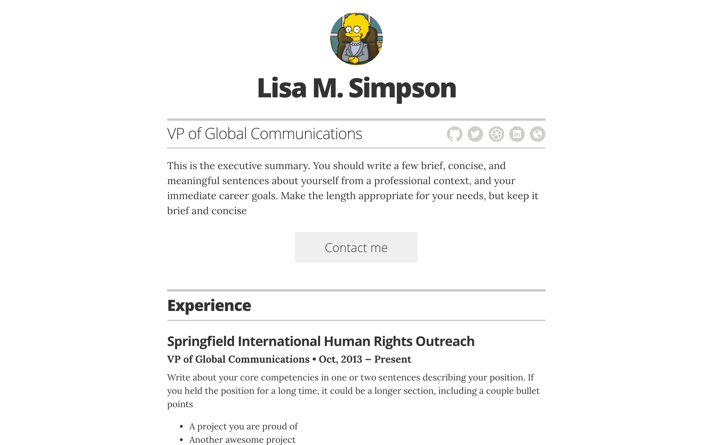

# 简历模板

*一个简单的 Jekyll + GitHub Pages 简历模板。*

## 文档

### 本地运行

要在本地测试，请在终端中运行以下命令：

1. 本地克隆 repo
1. `bundle install`
2. `bundle exec jekyll serve`
3. 打开浏览器到 `localhost:4000`

### 使用 Docker 本地运行

要在本地使用 docker 测试，请在将 docker 安装到系统中后在终端中运行以下命令：

1. `docker image build -t resume-template .`
2. `docker run --rm --name resume-template -v "$PWD":/home/app --network host resume-template`

### 自定义

首先，您需要将 repo 分叉到您自己的帐户。然后将其克隆到本地并进行自定义，或使用 GitHub Web 编辑器进行自定义。

#### 选项/配置

大多数基本自定义将在 `/_config.yml` 文件中进行。以下是通过 `/_config.yml` 提供的自定义列表：

[...写出这些...]

#### 编辑内容

大多数内容配置将在 `/_layouts/resume.html` 文件中进行。只需在那里编辑相应的标记即可

### 免费发布到 GitHub Pages

[GitHub Pages](https://pages.github.com/) 将使用您的 GitHub 帐户免费托管此内容。只需确保您使用的是 `gh-pages` 分支，该站点将自动在 `yourusername.github.io/resume-template` 上可用（如果您希望它在 `yourusername.github.io/resume` 上可用，您可以将 repo 重命名为 resume 以供自己使用）。如果您希望它在自定义域中可用，您还可以添加 CNAME...

### 使用您自己的域名进行配置

要使用自定义域设置您的 GH Pages 站点，请[按照 GitHub 帮助站点上该主题的说明](https://help.github.com/articles/setting-up-a-custom-domain-with-github-pages/)。

### 主题

目前 resume-template 只有一个主题。不过，更多主题即将推出。:heart:

## 路线图

功能路线图[可在此处获取](https://github.com/jglovier/resume-template/projects/1)。如果您有功能建议，请[打开新问题](https://github.com/jglovier/resume-template/issues/new)。

## 贡献

如果您发现错误，或者想要改进代码，甚至让虚拟内容变得更好，您可以执行以下操作：

1. [打开问题](https://github.com/jglovier/resume-template/issues/new) 描述错误或功能想法
2. 分叉项目，进行更改，并提交拉取请求

## 许可证

代码和样式根据 MIT 许可证获得许可。[请参阅项目许可证。](许可证) 显然，您不应在自己的简历中使用此演示存储库的内容。:wink:

免责声明：出于教育目的，使用 Lisa M. Simpson 图像和名称符合 [合理使用](https://en.wikipedia.org/wiki/Fair_use)。项目许可证不适用于此材料的使用。